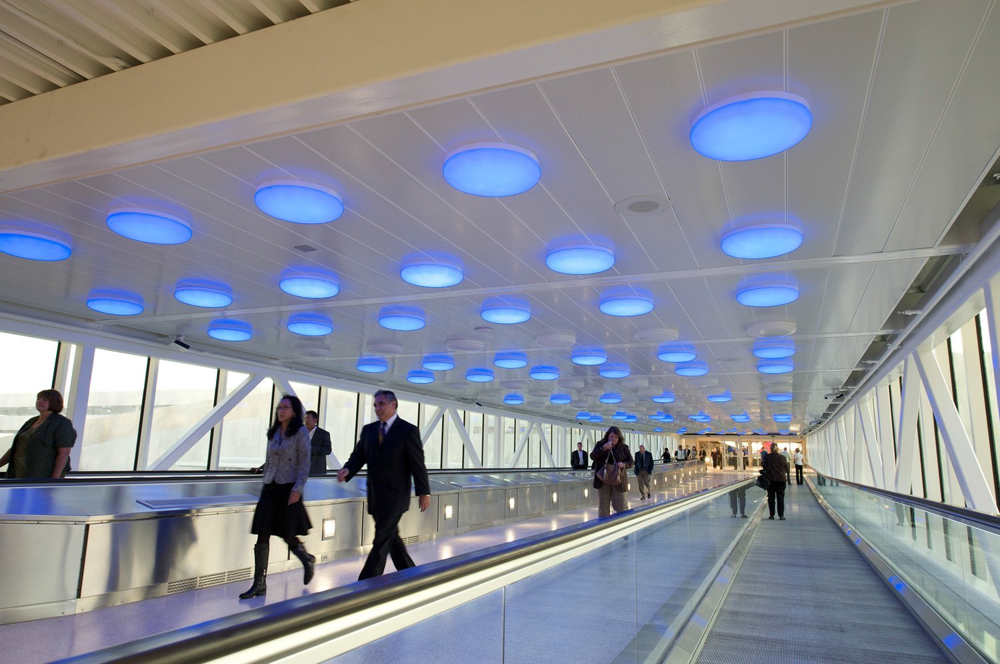

## Who We Are

LEDpac is an innovative LED company designing products and systems for economical and functional application. Founded in 2000, LEDpac has developed products for application in interior coves, cabinets, display cases, signage, downlights, landscape lights and many other applications.

In 2010 LEDpac expanded their product offering to include a broad list of new lamp replacement products including MR16, PAR20, PAR30, BR30 and PAR38 shapes. New, more efficient LED modules in many of the original LEDpac product line has allowed for more effective light distribution and up to 75% higher light output from the same original package.

In 2020 at the outset of the Coronavirus pandemic, LEDpac pivoted to UV-C LED disinfectant products to help fight the virus.

Now, LEDPac has returned to its roots: designing the best LED lighting solutions.

---

## Patented Technology

LEDpac has 4 patents in LED technology, with 12 additional patents pending. One of the first LED companies to submit products under the UL2108 guidelines, LEDpac offers a range of UL listed products and electronic systems using only the finest LEDs available.

## Our Commitment

LEDPac is committed to staying at the forefront of LED technology innovation while providing personalized service and expert installation. Our team of lighting professionals ensures that every project meets the highest standards of quality and performance.
